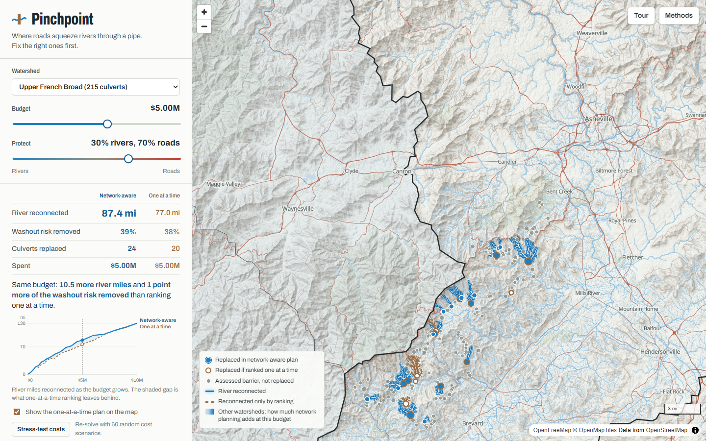

# Pinchpoint

**Where roads squeeze rivers through a pipe. Fix the right ones first.**

WolfHacks 2026 · Center for Geospatial Analytics track: *use geospatial data to understand a pressing societal or environmental issue, and build software that helps determine where to take action.*



## The problem

Every place a road crosses a stream, the water goes through a culvert. When the culvert is narrower than the stream, it fails twice:

- **In floods it plugs and washes the road out.** Hurricane Helene damaged nearly 9,500 sites on western North Carolina's state roads. NCDOT's January 2025 count included 867 culverts. NCDOT puts transportation recovery at about $5.8 billion.
- **The rest of the time it walls the river off.** Fish below cannot reach the habitat above. In NC, field crews have assessed 887 road crossings that cut a stream network; 800 of them are barriers to fish (National Aquatic Barrier Inventory).

The fix is the same for both: a crossing as wide as the stream. After Tropical Storm Irene, stream-width crossings in Vermont came through largely undamaged while undersized pipes failed (Gillespie et al. 2014). There is money for it: a $1B federal culvert program (Bipartisan Infrastructure Law, FY22–26) and Helene rebuilding funds. But there is not enough money for all of them, so someone has to choose.

Today that choice is usually made one culvert at a time: score each crossing on its own and fund down the list. A river is a network, though. A culvert's value depends on the culverts below it, and a road agency and a fish agency rank the same pipes by different lists.

## What Pinchpoint does

Pick a watershed, set a budget, and say how much you care about rivers vs. roads. Pinchpoint returns the best set of culverts to replace, and compares it live with one-at-a-time ranking:

- **Map:** culverts it would replace, the ones ranking would replace, and the river miles each plan reconnects. The river lines are networks we rebuilt from USGS NHDPlus HR flowlines.
- **Budget curve:** river miles reconnected as the budget grows, for both approaches. The shaded gap is what ranking leaves behind.
- **Field sheet per culvert:** assessment, constriction, drainage area, river above and below, planning cost, washout score, and why it was or wasn't chosen.
- **Statewide shading:** every watershed is shaded by how much network planning adds at the current budget. Hover to see the numbers, click to open it. This answers "where to act" at two scales: which watershed, then which culverts.
- **Stress test:** re-solves under 60 random cost scenarios and reports how often the plan still wins and which picks are robust.
- **Download plan (CSV):** the selected culverts with coordinates, roads, costs and inventory links, ready for a field crew.
- **Guided tour** for the 3-minute version.

## What we found

| | |
|---|---|
| **Chains are where planning pays.** | On Cherry Creek near Canton, two culverts in a row each open only 1.4 miles alone, so ranking skips both. Together they reconnect 8.2 miles. $1M in the Pigeon watershed goes from 7.2 to 12.6 river miles (+75%). On Whiteoak Creek (Upper Little Tennessee), two culverts that each score zero on their own open 9.6 miles together. |
| **Most watersheds have few chains.** | Across the 10 NC watersheds with at least 15 assessed culverts, network-aware plans reconnect 1,256 vs 1,234 river miles at $5M each (+2%). In the Upper French Broad (Asheville) at $2M: 46.6 vs 39.6 miles (+18%). The tool shows where ranking is good enough. |
| **Rivers and roads trade off unevenly.** | At $5M in the Upper French Broad, a plan for washout risk alone reconnects 66% of the river miles a river plan would. A plan for rivers alone still removes 85% of the washout risk a roads plan would. A 70/30 roads-leaning plan keeps 91% and 94%. |

## How it works

```
NABI public API (assessed culverts + dams, NC)       USGS NHDPlus HR (region 0601 geodatabase)
          │                                                        │
pipeline/build_forest.py                               pipeline/build_streams.py
  tree of culverts via downstream barrier IDs            snap 872 barriers to flowlines (median 0.1 m)
  planning cost + washout screening score                walk downstream by HydroSeq, assign every
  topology check                                         stretch to the first barrier below it
          │                                                        │
pipeline/optimizer.py  ◄── exact optimizer ──►  app/solver.js (same algorithm, in the browser)
          │
pipeline/analyze.py: statewide comparison, cost Monte Carlo, rivers-vs-roads frontier
          │
app/: MapLibre GL + hillshade + contours, live optimization, plain HTML/CSS/JS
```

**Objective.** The inventory scores one culvert by its gain, `min(upstream miles, downstream miles)`. We use the same rule for bundles. A chain of culverts hangs from an *anchor*: the river below the lowest culvert, bounded by a dam, a waterfall or the outlet. A plan reconnects the miles above every culvert whose path down to the anchor is fully open, capped at the anchor's length. For one culvert this is exactly the inventory's gain. The flood term is a screening index (constriction × drainage size × road type), additive per culvert. A slider weights the two.

**Optimizer (exact).**
- Chains where the cap cannot bind use a two-state tree dynamic program, where each culvert knows whether the river below it is open or closed.
- Chains where the cap can bind (44 in NC, at most 15 culverts) are enumerated.
- Chains are joined by max-plus convolution over budget.

One pass gives the optimum for every budget up to $20M. The Upper French Broad (215 culverts) solves in well under a second in the browser.

## Validation

| Check | Result |
|---|---|
| Tree topology: a culvert's downstream network length equals its parent's upstream length | **244 / 244** culvert-to-culvert links exact |
| Optimizer = brute-force enumeration (random forests, all budgets and weights) | **300 / 300** (Python), **200 / 200** (browser solver vs Python) |
| River networks rebuilt from raw NHDPlus HR reproduce inventory upstream miles | **88%** of 405 culverts within 5%, median error 0.4%, across 7 watersheds |
| Advantage survives cost uncertainty (lognormal σ = 0.5 per culvert) | network-aware ≥ ranking in **200 / 200** statewide draws, median +4% |
| Second metric: the inventory's gain rule applied to every merge (not optimized) | roughly tied with ranking (1,256 vs 1,248 mi at $5M), reported as is |

Run them yourself:

```bash
python -m pytest tests/
node tests/test_solver_js.mjs
```

## Run it

```bash
python -m venv .venv && .venv/Scripts/pip install pandas numpy geopandas shapely pyproj pyogrio requests pytest
python pipeline/build_forest.py     # data/processed/culverts_nc.csv
python pipeline/analyze.py          # results/summary.json, statewide.csv
python pipeline/export_app.py       # app/data/*.json
python pipeline/build_streams.py 06010105   # needs the NHDPlus HR 0601 geodatabase in data/raw/
python -m http.server 8765 --directory app  # open http://localhost:8765
```

Raw data is fetched from public endpoints (see `notes/plan.md`). The NABI CSVs come from `https://tool.aquaticbarriers.org/api/v1/public/{barriers,dams}/state?id=NC`.

## Limits

- **Costs are planning-level estimates:** stream-width span from NC regional bankfull curves, times a per-foot price by road type, plus mobilization. The stress test shows how much the plan depends on them.
- **The washout score is a screening index**, not a failure probability. Helene's damaged-culvert locations are not public, so we could not check it against real failures. That is the first thing we would validate with NCDOT data.
- **Only field-assessed culverts are candidates** (the 800 assessed barriers that cut a network). Most NC road crossings have never been surveyed.
- **Dams and waterfalls are permanent.** Waterfalls are not in the public download, which is most of why 12% of rebuilt networks miss by more than 5%.
- **Habitat is counted in miles**, not by species or habitat quality.

## Data and references

- National Aquatic Barrier Inventory & Prioritization Tool, Southeast Aquatic Resources Partnership: public API, downloaded 3 Oct 2026.
- USGS NHDPlus High Resolution (region 0601) and Watershed Boundary Dataset.
- Basemap © OpenStreetMap contributors via OpenFreeMap. Terrain: AWS Terrain Tiles.
- Gillespie, N. et al. 2014. Flood effects on road–stream crossing infrastructure: economic and ecological benefits of stream simulation designs. *Fisheries* 39(2):62–76.
- Cote, D. et al. 2009. A new measure of longitudinal connectivity for stream networks. *Landscape Ecology* 24:101–113.
- Prior work on optimizing barrier removal: O'Hanley, J. R. & Tomberlin, D. 2005. Optimizing the removal of small fish passage barriers. *Environmental Modeling & Assessment* 10(2):85–98. King, S. et al. 2017. A toolkit for optimizing fish passage barrier mitigation actions. *Journal of Applied Ecology*. Pinchpoint brings this kind of optimization to NC's public inventory, jointly with flood risk, in the browser.
- Helene damage: NCDOT figures reported by Carolina Journal (22 Jan 2025: 9,307 damage sites including 867 culverts) and 828 News NOW (26 Sep 2026: nearly 9,500 sites, about $5.8B recovery). Culvert grant program: FHWA.

## AI usage

WolfHacks requires teams to cite AI use. We used AI heavily, and this section says where and how we checked it.

**Tools**
- **Claude (Anthropic), through Claude Code:** idea generation; the data pipeline, optimizer, tests and web app code; and drafting this README and the DevPost text.
- **GPT (OpenAI), through the Hermes agent CLI:** an independent second idea pool, and two of the advisor and peer-reviewer seats in an idea "council." We used two model families so one model's blind spots and self-preference would not decide the project. The full council transcript, prompts and outputs are in `ideation/council/`.

**How we chose the idea.** Each model wrote its own idea pool without seeing the other's (`ideation/claude_divergent.md`, `ideation/hermes_divergent_raw.md`). We verified every dataset against a live endpoint. Then a five-advisor council judged the source-blinded pool, and peer reviewers from both models critiqued it (`ideation/council/`). We picked the culvert idea from the three finalists in `ideation/PROPOSALS.md`.

**Prompts we used** (excerpts; full text in the repo):

> "Approach this hackathon track from a different perspective… create a genuinely unique (not just a win hackathon type) of solution. Propose me 3 different potential ideas… use hermes… to get potentially different perspectives." (team to Claude)

> "I like the culvert idea… make it into something presentable. A judge shouldn't look at it and be like 'it seems extremely specific and not high impact' since culverts aren't something people think about much at all, so frame it accordingly. Read the requirements exactly." (team to Claude)

> "PART 1 – THE MODE. List the 15 project ideas that most teams in this track will predictably build… These are banned for Part 2. PART 2 – EIGHT IDEAS OUTSIDE THE MODE… Give the publisher and URL ONLY if you are confident it exists… otherwise write UNVERIFIED." (to GPT, `ideation/prompts/hermes_divergent.md`)

> "You are The Contrarian on an LLM Council… Deliver your top 3 idea IDs… and the 2 ideas you would kill and the precise reason." (one of five advisor prompts, `ideation/council/prompt_*.md`)

**How we checked AI-written work**
- Model-written code was tested before any of its numbers went into the app. For example, testing against the inventory's own `min(upstream, downstream)` rule showed that a culvert above a short pocket (such as one under a dam) must be capped at what that pocket can hold. The final optimizer handles that cap exactly.
- Two models picked ideas from their own pool even with sources hidden (GPT advisors 6/6, Claude advisors 8/9). So the final call weighted only points both families agreed on (see `ideation/PROPOSALS.md`).
- Every figure in this repo is produced by a script in `pipeline/` from public data. The optimizer is checked against brute force, and the stream networks against the inventory.

## Team

Pavan Parola, plus teammates listed on DevPost.
